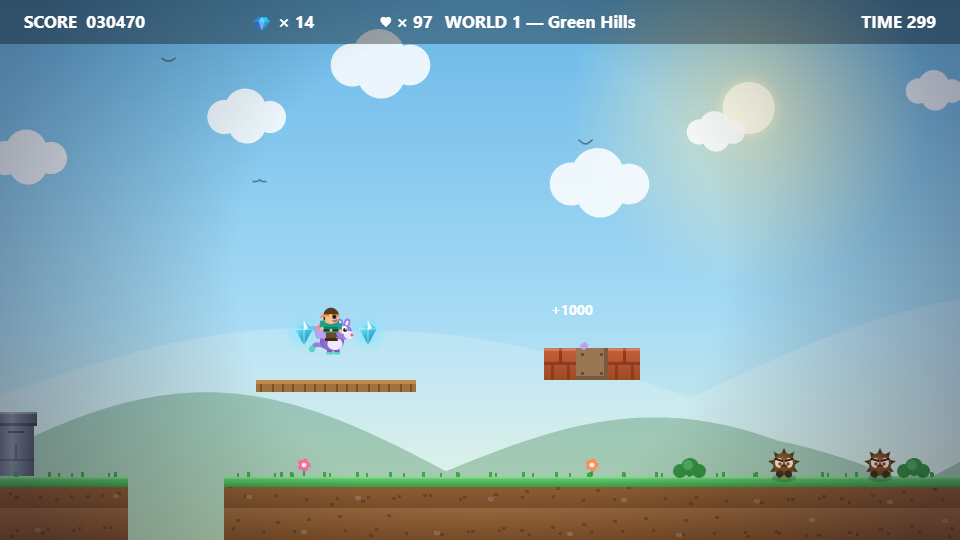
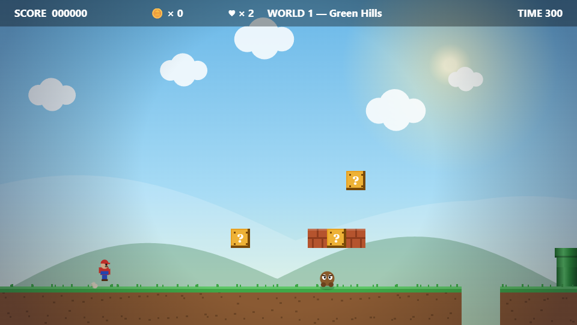
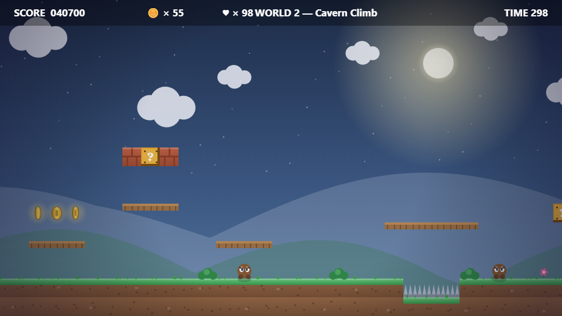
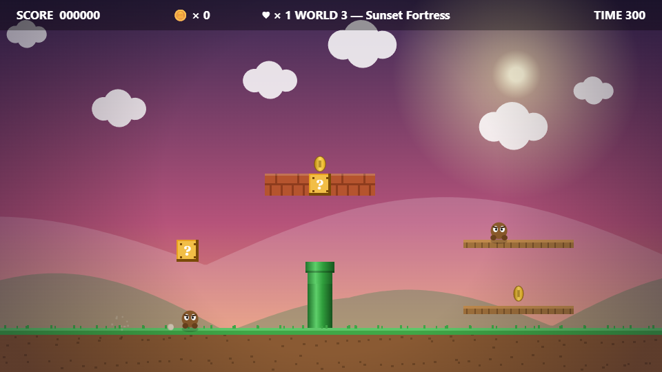

# Super Nico World 🍄

### [▶ Play now in your browser](https://nicholasaryelferreira.github.io/super-nico-world/)

[](https://nicholasaryelferreira.github.io/super-nico-world/)

A polished retro-style platformer with an all-original cast, art, and soundtrack that runs entirely in your browser — no installs, no downloads, no asset files. All graphics are rendered live on an HTML5 canvas (parallax skies, particles, soft shadows, screen shake) and all music and sound effects are synthesized in real time with the Web Audio API.

## Screenshots



| World 1 — Green Hills | World 2 — Cavern Climb | World 3 — Sunset Fortress |
|---|---|---|
|  |  |  |

## How to play

1. Open **Command Prompt** (press `Win`, type `cmd`, press Enter).
2. Go to the game folder — copy-paste this command and press Enter:
   ```
   cd "C:\Users\nafer\github repo\Super Nico World"
   ```
3. Start a local server — copy-paste this command and press Enter:
   ```
   npx --yes http-server -p 8123 -c-1 .
   ```
4. Open your browser (Chrome/Edge) and go to: **http://localhost:8123**
5. Click **START GAME**.

(Alternative with no server: double-click `index.html` in File Explorer — it works directly too.)

## Controls

| Key | Action |
|---|---|
| `←` `→` or `A` `D` | Move |
| `Space` / `↑` / `W` | Jump (hold for higher jumps) |
| `Shift` | Run |
| `P` | Pause |
| `M` | Mute |
| `Enter` | Restart after game over / victory |

## Features

- **3 worlds**: Green Hills, Cavern Climb, Sunset Fortress — each with its own sky palette.
- **Tight platforming feel**: coyote time, jump buffering, variable jump height, squash & stretch.
- **Original enemies**: spiky **Thornlings** to stomp and armored **Curlbugs** that curl into rolling balls you can kick into other enemies.
- **Power-ups**: star prize blocks hide crystal gems and glowing **Sunfruit**; grow big to break bricks. Every 50 gems = extra life.
- **🪽 Glydon, the rideable sky-glider**: every world hides a speckled-egg block. Crack it open, hop on Glydon, and **hold Jump in mid-air to fly**. If you get hit, Glydon runs off — chase it down to remount!
- **Fair-by-design levels**: built with a level generator that guarantees every gap and climb is within jump range, verified by an automated playthrough bot.
- **Hazards**: spikes, pits, and a countdown timer.
- **Procedural audio**: a chiptune overworld theme plus jump/coin/stomp/power-up/victory sounds, all generated at runtime.

Reach the flag at the end of each world. Good luck! 🚩

## License

Released under the [MIT License](LICENSE) — © 2026 Nicholas Aryel Ferreira.
